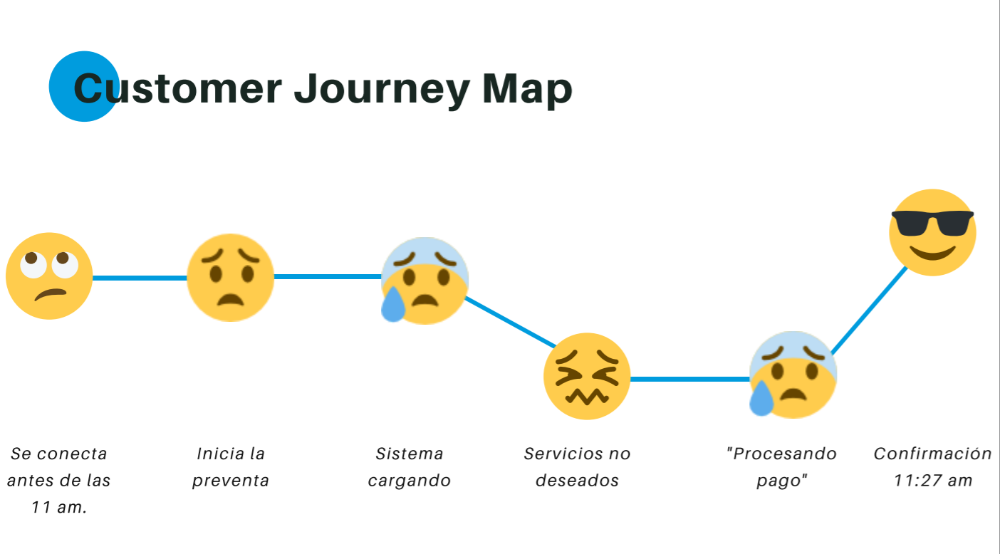
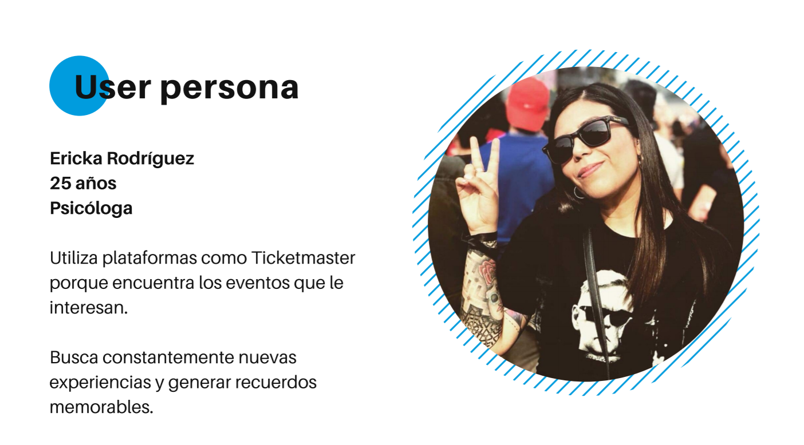

# Contexto

A muchas personas les encantan los espectáculos: conciertos, obras de teatro, partidos de fútbol, partidos de basquetbol, circos, entre otros. Sin embargo, en muchos casos, conseguir boletos para estos espectáculos, no siempre es la mejor experiencia que se pueda esperar en 2019. 

La venta oficial de entradas en taquilla, obliga a los usuarios a enfrentarse a traslados, largas filas y revendedores. En un esfuerzo por garantizar al usuario una mejor experiencia en la compra de boletos, las empresas han invertido en plataformas online a través de las cuales los usuarios puedan realizar transacciones mucho más seguras y sencillas. Además, privilegios para clientes de bancos, tales como la posibilidad de pagar boletos a meses sin intereses o las preventas exclusivas, también han impactado en la experiencia.

Algunas de las principales empresas que operan en el mercado internacional de venta de boletos incluyen a Razorgato, StubHub, Ticketmaster, Garrapata Fandango, AOL Inc ., Atom Tickets LLC, Fandango, Movietickets.com, Grandes cines, Cinemark Holdings Inc ., BookMyShow.com, Vue Entertainment, Mtime y Kyazoonga.

## Tickemtaster
 
El objetivo es entender los distintos problemas relacionados a la venta de boletos para espectáculos, tanto del lado de las personas que utilizan el servicio como del lado del negocio.  

El mayor actor en el mercado de venta de boletos nos ha contactado para rediseñar su plataforma. [Ticketmaster](https://www.ticketmaster.com.mx/) opera en México desde principios de los 90, mediante un acuerdo para el uso y expansión de la marca por parte de CIE con su contraparte Ticketmaster USA.  En la última década, la expansión de las conexiones a internet, los teléfonos móviles, las redes sociales y los emprendimientos digitales han creado nuevas formas de competir en este mercado y ahora tenemos empresas como Eventbrite, Meetup.com, Facebook o Boletia compitiendo en este sector. Ticketmaster no se quiere quedar a atrás y está buscando modernizar su plataforma. 

Como parte del reto, Ticketmaster ha pedido que se ralizara lo siguiente:

- Entender a los usuarios actuales del mercado de boletos
- Entender el mercado actual de venta de boletos en México y en el Mundo.
- Crear, testear, iterar (muchas veces) una nueva propuesta del diseño de la plataforma: 
  dependiendo de los problemas que identifiques, puedes elegir uno o varios de ellos para re-diseñar
- Crear y testear el flujo de la plataforma
- Presentar dos propuestas de diseño para ese flujo

## Proceso de diseño

Para llegar a la propuesta de una solución se utilizó el método de Design Thinking. En la fase de empatía y definición se aplicó una encuesta a 20 personas consumidoras de boletos a través de Ticketmaster -usuarias o no del portal-, con el fin de conocer qué pensaban y si estaban satisfechos con el servicio.

Asimismo, se realizaron 4 entrevistas a usuarios frecuentes de Ticketmaster con el propósito de conocer cuál era el journey map durante su proceso de compra a través de la plataforma. Como resultado, se identificó que el mayor punto de conflicto para los usuarios era durante la preventa: el sistema se saturaba, tardaban más de 30 minutos para conseguir boletos, la casilla de verificación de "no soy un robot" era molesto, etc.

Con base en lo anterior, se construyó una user persona: Erika Rodríguez.

En la fase de ideación, gracias a la herramienta de *How might we?*, la pregunta clave para iniciar la propuesta se definió de la siguiente manera: "¿Cómo podríamos agilizar el servicio de preventa Ticketmaster?".

Posteriormente, a través de la herramienta *crazy 8's* se propusieron ideas para disminuir la "entrada" de los usuarios al mismo tiempo cuando la preventa inicie, entre las que destacaron:
* Crear dinámicas a través de rallys, concursos donde se entregaran códigos para asegurar el acceso a preventas.
* Crear alianzas con marcas de cerveza, agua o papas fritas para repartir códigos para asegurar el acceso a preventas.
* Crear retos para juntar materiales reciclables con el fin de otorgar códigos a quienes más acumulen objetos como latas de aluminio, botellas pet, cartón, papel, etc.

Sin embargo, las ideas anteriores se enfocaban más desde una perspectiva de marketing y no hacia una solución para agilizar el proceso de preventa en la plataforma de Ticketmaster. Finalmente, surgió la propuesta de crear dos formas de comprar boletos:
1. Preventa Súper fan: en un horario específico, se dejará acceder a personas que quieran adquirir de 1 a 3 boletos. Al finalizar la compra, se solicitará que los boletos sean personalizados ingresando el nombre de los asistentes con el objetivo de disminuir la compra para reventa ilegal.
2. Preventa Súper Grupo: después de la preventa para la modalidad Súper Fan, se dará acceso a personas que quieran adquirir de 4-8 boletos. En esta modalidad, las personas no necesitarán personalizar los boletos, considerando -el gran secreto a voces- que los revendedores tiene un acuerdo de ventas con Ticketmaster.

## Prototipo
De la página de Ticketmaster, se logró reducir el flujo de compra de 9 a 4 pasos gracias a un benchmark con páginas como ticketnetwork.com y la versión estadounidense de la propia Ticketmaster.

## KPI's
Entre las métricas para medir resultados a futuro se consideró lo siguiente:
* Tiempo de navegación del usuario en la plataforma Ticketmaster durante el proceso de compra en prevente.
* Grado de satisfacción del usuario con el nuevo flujo en el proceso de compra.
* Número de visitas válidas: usuarios que SÍ finalizan su compra con boletos comprados.
* Número de usuarios en preventa súperfan vs número de usuarios en preventa súper grupo.
* Ratio de clientes nuevos respecto al total de clientes en cartera (tasa de conversión)

Durante el testeo, realizado a 10 personas apegadas al perfil de Erika Rodríguez, se pudo iterar de manera rápida aspectos del flujo de navegación y, a la par, se pudo conocer la opinión de los usuarios respecto a la personalización de los boletos:
1. 4 usuarios se cuestionaban el porqué debían personalizar el boleto, pues consideraban que era un paso extra y volvía la experiencia de compra aún más tediosa.
2. A 2 usuarios les agradó la idea de personalizar boletos porque lo consideran un valor agregado, les permite generar un recuerdo de una gran experiencia tras haber asistido a un evento de interés y gusto personal.

Finalmente, con base en los hallazgos durante el test, se comprobó que la propuesta para agilizar el proceso de compra en preventa en realidad no estaba siendo percibido como un proceso ágil. Por lo tanto, como siguiente iteración se tiene el objetivo de regresar a la fase de ideación para proponer otra solución en donde el usuario no sienta que se agregaron pasos o que la compra de boletos es más complicada.

